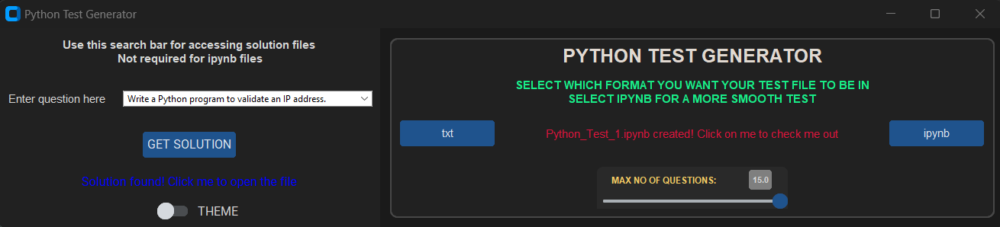
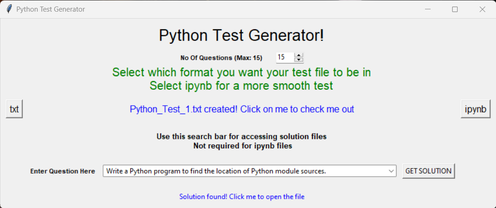
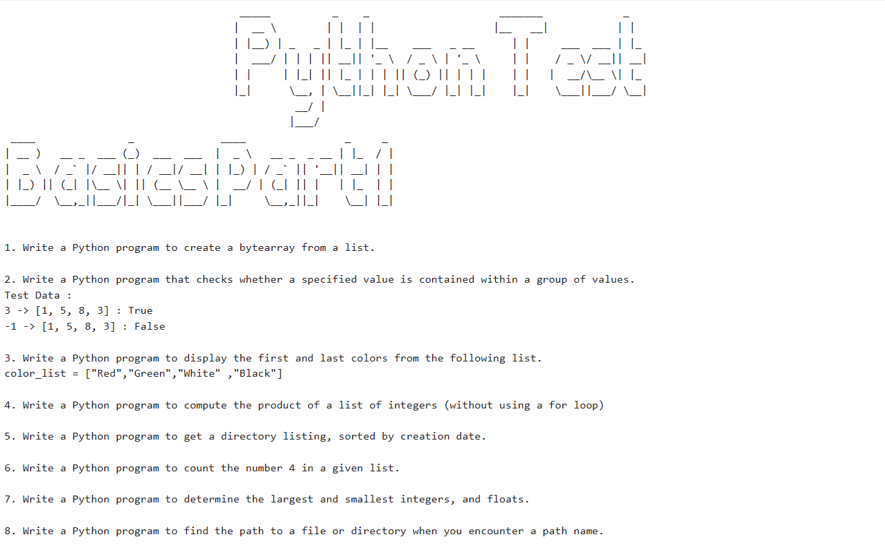
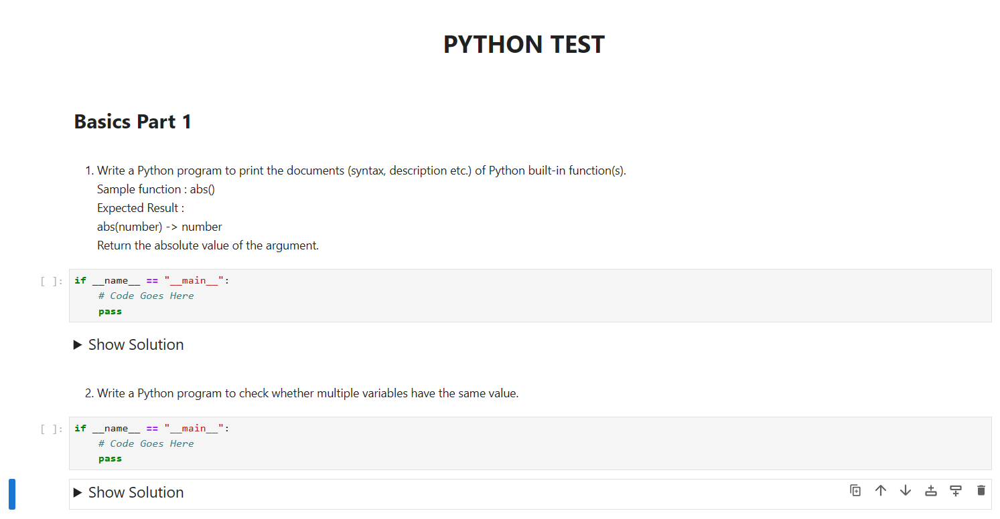
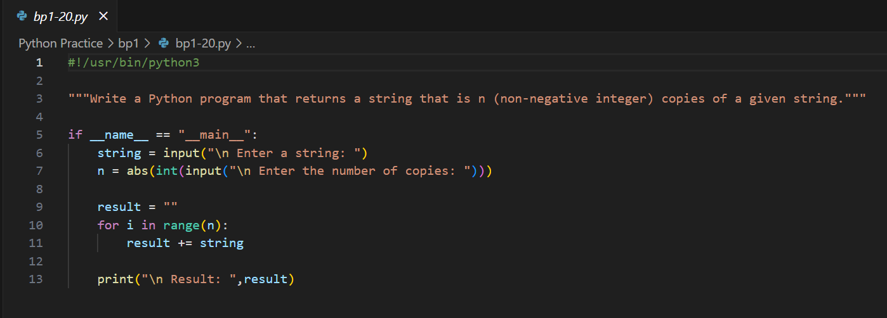

# python-practice

<figure>
    <blockquote>
        Take up an idea, devote yourself, struggle in patience, and the sun will rise. 
        <b><i>Swami Vivekananda</i></b>
    </blockquote>
</figure>

<h2>Introduction</h2>
This came about when my brother wanted to learn python and he was too lazy to even code, as he found it intimidating. His problem was that he was able to understand the code itself, he was not getting enough practice done and he was thus not being exposed to it more. When I asked how I could help, he said he would like to know the different ways in which python can be used for making life easier. So, I decided that every now and then, I would provide him with a set of questions that he could solve, so that he does not feel overwhelmed and can solve it whenever he wants. 

Problem is, I am too lazy to make my own test, setting them up in a text file, and then presenting them to my brother everyday. So I, a very amateur programmer, decided to make this simple script that would just automate it easily.    

<h2>Details</h2>

<b>NOTE: </b>You would definitely find better versions of this on the internet, this is only to solve the purpose of making a test.

This code generates a python test file consisting of questions taken from the files under the different topic directories. A set number of questions are randomly chosen from each topic directory and are written to the test file.
The test file can be either in the format of a text file (.txt) or a notebook file (.ipynb). 
The option of which format is to be used is to be selected by the user using the GUI presented by the code.

The text file format should be considered as practicing without a crutch. If you are not able to solve the 
question at first, try to research more about relevant modules that can come to use. You can also google to see if there are any solutions provided in the online forums, although I would recommend to first try it by yourself until you are absolutely certain you cannot do it. Alternatively, you may use the search bar provided in the GUI to find a solution to the questions, although it is simply limited to the files that are provided in the topic directories.

If you would like a more simpler or efficient practice approach, use the ipynb format. You would need a notebook viewer for this, like Jupyter Notebook or Google Collab Notebooks (at least this way, you don't have to install anything). A code space and kernel is provided this way, and while solutions are also provided along with the questions, they are hidden at first, and should only be opened after you try it yourself. 

<h2>How to Install and Use</h2>

Before downloading any of the files, please make sure you have the latest version of Python installed (this one is tested on v3.11.4), and you have the following modules installed using pip:
<ul>
    <li>nbformat &#91;For Notebook Creation&#93;</li>
    <li>ttkwidgets</li>
    <li>art &#91;<b>NOTE:</b> This one is actually optional and only used for writing the decorated text in txt file format. If you don't like this, open up the testGen.py script, go to the txtOps and ipynb function, and find the <b>OPTIONAL</b> comments.&#93;  &#91;Alternatively, in the text2art functions, you may change the fonts to one of the following ASCII fonts in this list (Non-ASCII doesn't work): <a href = "https://github.com/sepandhaghighi/art/blob/master/FontList.ipynb">Art Module Font List</a>&#93;</li>
    <li>tkinter &#91;<b>For the inter.py script</b>&#93;</li>
    <li>customtkinter &#91;<b>For the inter_mod.py script</b>&#93;</li>
    <li>ttkwidgets</li>
    <li>fuzzywuzzy and python-Levenshtein</li>
</ul>

After ensuring these conditions, download the testGen.py script, <b>atleast one of the different topic directories</b> and either the inter.py or inter_mod.py script and <b>put them in the same directory</b>. You could use a different topic directory, but just make sure that <b>there are atleast three unique files</b>, and <b>make sure that the first multiline comment is the question</b>, otherwise, it will not work as intended (like I said, I am an amateur at this). Check out how the code file looks like in the topic directories I provided. 

Then, run the inter script or the inter_mod script and the GUI will be presented. Aternatively, you could convert the script into an .exe file using pyinstaller, for which I would suggest using a spec file for building exe. Use the GUI to set the number of questions that will be picked from each topic directory provided. Then select either the txt button or the ipynb button, then the link will be provided, which can be clicked to open up the file, or the file can be found in the Test Attempts Folder that would be generated.

<b>&#91;COMING SOON:</b> Notebooks might come with a time frame, and a score system will be given, thus creating a harder environment toggle for Notebooks<b>&#93;</b>

<h2>Preview</h2>

<figure>
    
    <figcaption><i>inter_mod.py</i></figcaption>
</figure>

<figure>
    
    <figcaption><i>inter.py</i></figcaption>
</figure>

<figure>
    
    <figcaption><i>Test File (.txt version)</i></figcaption>
</figure>

<figure>
    
    <figcaption><i>Test File (.ipynb version)</i></figcaption>
</figure>

<figure>
    
    <figcaption><i>Code Format</i></figcaption>
</figure>

<h2>References</h2>

All of these questions are taken from the W3Resource Website
<a href = "https://www.w3resource.com/python-exercises/">https://www.w3resource.com/python-exercises/</a>

<h2>Change Log</h2>

<h4>v1.2 Key Highlights:</h4>
<ul>
    <li>Added more files to bp2</li>
    <li>Added topic dir npb (Numpy basics)</li>
    <li>Modified testGen to accomodate for npb</li>
</ul>

<h4>v1.1 Key Highlights:</h4>
<ul>
    <li>Fixed some code in the testGen script</li>
    <li>Added more files to bp1</li>
    <li>Added topic dir bp2</li>
    <li>Made a modern GUI using customtkinter</li>
    <li>Gave the user the option to change between the customtkinter version or the tkinter version
    by seperating the code in different files</li>
</ul>

<h4>v1.0 Key Highlights:</h4>
<ul>
    <li>Created testGen script to create test files</li>
    <li>Added choice between generating test file in .txt or .ipynb format</li>
    <li>Added the topic dir bp1</li>
</ul>